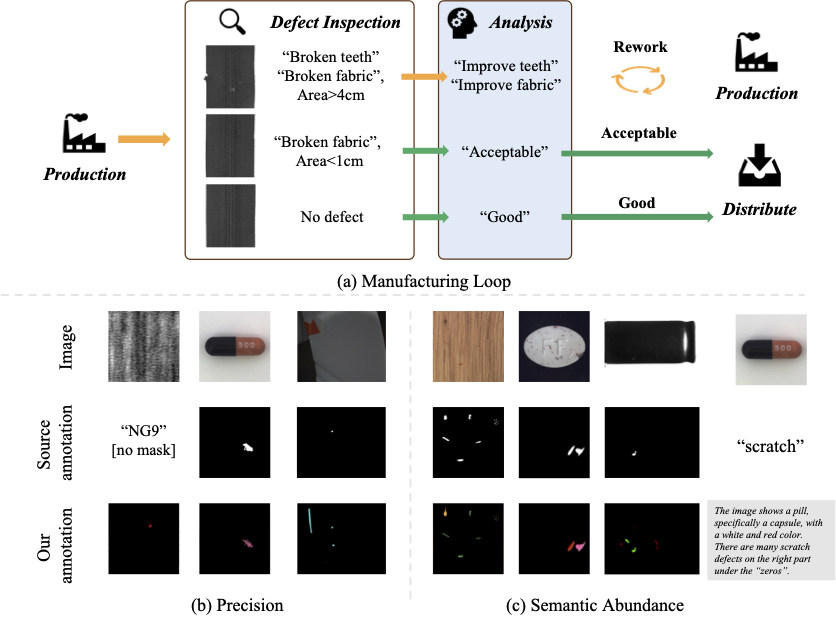
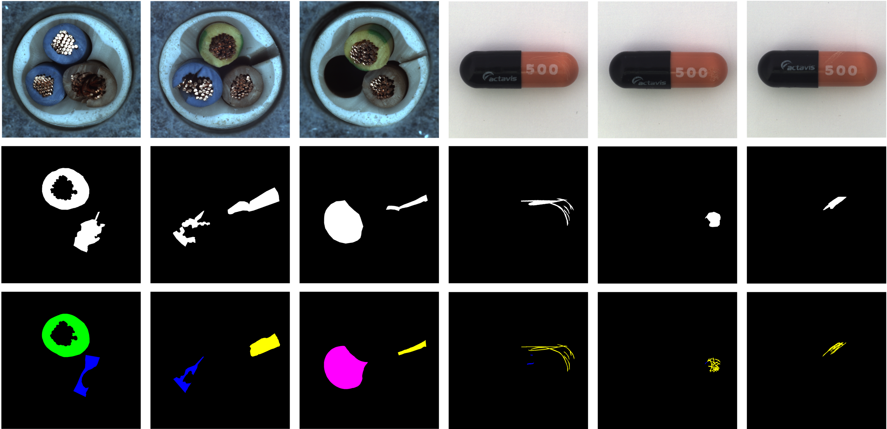

# Defect Spectrum: A Granular Look of Large-Scale Defect Datasets with Rich Semantics [ECCV 2024]
[Shuai Yang](https://andysonys.github.io/)$^{{\*}}$, [ZhiFei Chen]()$^{{\*}}$, [Pengguang Chen](), [Xi Fang](), [Yixun Liang](), [Shu Liu](), [Yingcong Chen](https://www.yingcong.me)$^{\**}$

HKUST(GZ), HKUST, SmartMore Corp.

${\*}$: Equal contribution.
\**: Corresponding author.

<a href="https://arxiv.org/abs/2310.17316"></a>
<a href="https://envision-research.github.io/Defect_Spectrum/"></a>
<a href="https://huggingface.co/datasets/DefectSpectrum/Defect_Spectrum"></a> 

## 🎏 Introduction

- We introduce the **Defect Spectrum**, a comprehensive benchmark that offers **precise**, **semantic-abundant**, and **large-scale** annotations for a wide range of industrial defects.
- We introduce the **Defect-Gen**, a generator designed to create high-quality and diverse defective images, even when working with limited defective data.

<details><summary>CLICK for the full abstract</summary>
Defect inspection is paramount within the closed-loop manufacturing system. However, existing datasets for defect inspection often lack the precision and semantic granularity required for practical applications. In this paper, we introduce the Defect Spectrum, a comprehensive benchmark that offers <b>precise</b>, <b>semantic-abundant</b>, and <b>large-scale</b> annotations for a wide range of industrial defects. Building on four key industrial benchmarks, our dataset refines existing annotations and introduces rich semantic details, distinguishing multiple defect types within a single image. With our dataset, we were able to achieve an increase of <b>10.74%</b> in the Recall rate, and a decrease of <b>33.10%</b> in the False Positive Rate (FPR) from the industrial simulation experiment. Furthermore, we introduce Defect-Gen, a two-stage diffusion-based generator designed to create high-quality and diverse defective images, even when working with limited defective data. The synthetic images generated by Defect-Gen significantly enhance the performance of defect segmentation models, achieving an improvement in mIoU scores up to <b>9.85</b> on Defect-Spectrum subsets.
</details>


<p align="center">  </p>


## 💡 Dataset Reannotation
Industrial datasets often lack detailed defect annotations, providing only binary masks or misclassifications. We introduce the Defect Spectrum, a comprehensive dataset with refined, large-scale annotations for various industrial defects. Using four industrial benchmarks, Defect Spectrum enhances annotation accuracy, capturing subtle and previously missed defects. Our dataset includes rich semantic annotations, identifying multiple defect types per image, and offers descriptive captions for each sample, facilitating future Vision Language Model research.

<div align=center>
 

Example annotation from MVTec AD Dataset
</div>


## 💡 Defect-Gen
Furthermore, we introduce **Defect-Gen**, a two-stage diffusion-based generator designed to create high-quality and diverse defective images, even when working with limited defective data. The synthetic images generated by Defect-Gen significantly enhance the performance of defect segmentation models, achieving an improvement in mIoU scores up to **9.85** on Defect-Spectrum subsets.


<div align="center"> 
 

Two-staged defect generation pipeline
</div>

This generative model excels in producing diverse and high-quality images, even when trained on limited data.
<div align="center"> 
 

Qualitative Comparison between Defect-Gen and other generation methods
</div>

## 🛠️ Installation
1. Create an environment with python==3.8.0 `conda create -n diff python==3.8.0`.
2. Activate it `conda activate diff`.
3. Install basic requirements `pip install -r requirements.txt`.

## 🚀 Getting Started
### Train your own Defect-Gens
1. Specify the number of defect types in `train_[large/small].sh` that corresponds to your own needs. e.g. If the "Capsule" object has 7 defective classes, set the `--num_defect` to 7. 
2. Prepare your config yaml file for both large and small models. The `-input channel` and `-output channel` should be a total of the number of defect types, RGB channels, and background channels(if needed). e.g. For an object that has 7 defective classes, the number of input/output channels should be set to 10. (excluding background)
3. Run it with `sh train_[large/small].sh`

### 🚀 Inference
1. All the checkpoints will be save to  `/[working_dir]/checkpoint`.
2. Update your checkpoints in `inference.sh`.
3. Specify your switching point for the large and small model in `--step_inference`. 
4. Specify your defective types in `--num_defect`.
2. Run inference with `sh inference.sh`.

## 📍 Citation 
If you find this project useful in your research, please consider citing:

```
@misc{yang2023defect,
      title={Defect Spectrum: A Granular Look of Large-Scale Defect Datasets with Rich Semantics}, 
      author={Shuai Yang and Zhifei Chen and Pengguang Chen and Xi Fang and Shu Liu and Yingcong Chen},
      year={2023},
      eprint={2310.17316},
      archivePrefix={arXiv},
      primaryClass={cs.CV}
}
```
## Acknowledgement
-  This work is built upon the [Guided-Diffusion](https://github.com/openai/guided-diffusion) and [SinDiffusion](https://github.com/weilunwang/sindiffusion).
-  The datasets we adopted come from [Apple-Vision](https://huggingface.co/datasets/VISION-Workshop/VISION-Datasets), [MVTec-AD](https://www.mvtec.com/company/research/datasets/mvtec-ad), [DAGM-2007](https://conferences.mpi-inf.mpg.de/dagm/2007/prizes.html) and [Cotton](https://www.cottoninc.com/quality-products/textile-resources/fabric-defect-glossary/).
-  We would like to extend our greatest thanks to those who helped at SmartMore Corp., regardless of whether their contributions are recognized or remain behind the scenes.
