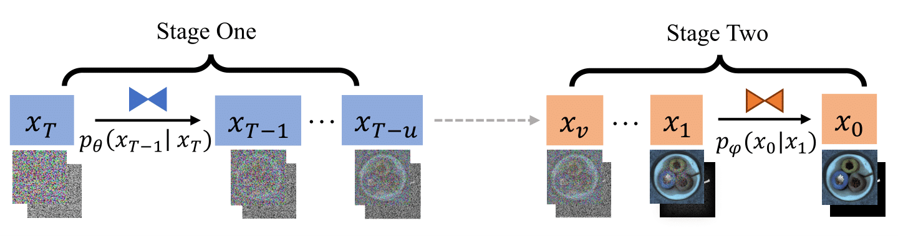

# Defect Spectrum: A Granular Look of Large-Scale Defect Datasets with Rich Semantics [ECCV 2024]

**[[Paper](https://arxiv.org/abs/2310.17316)][[Project Page](https://envision-research.github.io/Defect_Spectrum/)][[Dataset](https://huggingface.co/datasets/DefectSpectrum/Defect_Spectrum)]** <br />


This is the official implementation of the synthetic data part of ***Defect Spectrum***.

Defect inspection is paramount within the closed-loop manufacturing system. However, existing datasets for defect inspection often lack the precision and semantic granularity required for practical applications. In this paper, we introduce the **Defect Spectrum**, a comprehensive benchmark that offers **precise**, **semantic-abundant**, and **large-scale** annotations for a wide range of industrial defects.

Building on four key industrial benchmarks, our dataset refines existing annotations and introduces rich semantic details, distinguishing multiple defect types within a single image. With our dataset, we were able to achieve an increase of **10.74%** in the Recall rate, and a decrease of **33.10%** in the False Positive Rate (FPR) from the industrial simulation experiment.

Furthermore, we introduce **Defect-Gen**, a two-stage diffusion-based generator designed to create high-quality and diverse defective images, even when working with limited defective data. The synthetic images generated by Defect-Gen significantly enhance the performance of defect segmentation models, achieving an improvement in mIoU scores up to **9.85** on Defect-Spectrum subsets.


<p align="center">  </p>


## Installation
1. Create an environment with python==3.8.0 `conda create -n diff python==3.8.0`.
2. Activate it `conda activate diff`.
3. Install basic requirements `pip install -r requirements.txt`.

## Getting Started
### Train your own Defect-Gens
1. Specify the number of defect types in `train_[large/small].sh` corresponds to your own needs. 
2. Prepare your config yaml file for both large and small models. The input and output channel should be a total of the number of defect types, RGB channels, background channels(if needed).
3. Run it with `sh train_[large/small].sh`

### Inference
1. All the checkpoints will be save to  `/[working_dir]/checkpoint`.
2. Update your checkpoints in `inference.sh`.
3. Specify your switching point for the large and small model in `--step_inference`. 
4. Specify your defective types in `--num_defect`.
2. Run inference with `sh inference.sh`.

## Citation 
If you find this project useful in your research, please consider citing:

```
@misc{yang2023defect,
      title={Defect Spectrum: A Granular Look of Large-Scale Defect Datasets with Rich Semantics}, 
      author={Shuai Yang and Zhifei Chen and Pengguang Chen and Xi Fang and Shu Liu and Yingcong Chen},
      year={2023},
      eprint={2310.17316},
      archivePrefix={arXiv},
      primaryClass={cs.CV}
}
```
## Acknowledgement
-  This work is built upon the [Guided-Diffusion](https://github.com/openai/guided-diffusion) and [SinDiffusion](https://github.com/weilunwang/sindiffusion).
-  The datasets we adopted come from [Apple-Vision](https://huggingface.co/datasets/VISION-Workshop/VISION-Datasets), [MVTec-AD](https://www.mvtec.com/company/research/datasets/mvtec-ad), [DAGM-2007](https://conferences.mpi-inf.mpg.de/dagm/2007/prizes.html) and [Cotton](https://www.cottoninc.com/quality-products/textile-resources/fabric-defect-glossary/).
-  We would like to extend our greatest thanks to those who helped at SmartMore Corp., regardless of whether their contributions are recognized or remain behind the scenes.
